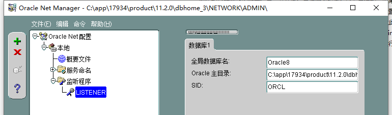

# Oracle 11g 安装

​​

如上图所示，将 win64_11gR2_database_1of2 解压出来，win64_11gR2_database_2of2解压到和 win64_11gR2_database_1of2同目录

然后安装过程中设置实例名和口令

​​

打开Net Manager 设置数据库服务的配置，切记要保存，然后重启如下服务：

​​

‍

‍

打开 Net Configuration Assistant配置监听程序

‍
